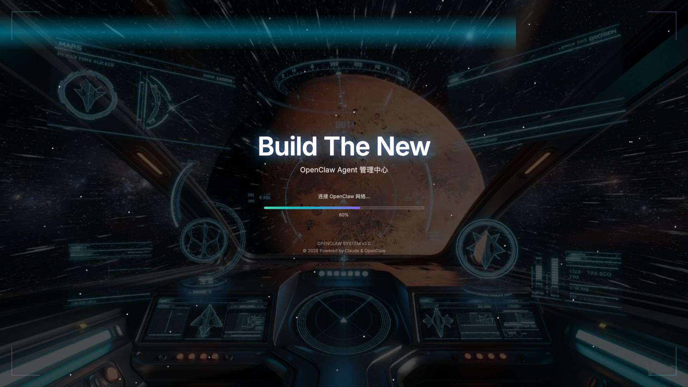

# 🚀 AgentForge GitHub 营销策略

**目标：** 让用户一看到GitHub页面就立刻想用！

**核心理念：** "3秒吸引 → 30秒种草 → 3分钟上手"

---

## 📊 数据驱动的目标

### 30天内达成
- ⭐ **GitHub Stars**: 1000+ (平均每天33个)
- 👀 **浏览量**: 10,000+ visits
- 🍴 **Forks**: 100+
- 💬 **Issues/Discussions**: 50+ engaged users
- 🐦 **社交传播**: 500+ Twitter/X mentions
- 📹 **视频演示**: 5,000+ views on YouTube

---

## 🎨 第一印象优化（0-3秒）

### 1. 震撼的Hero Banner

```markdown
# 🎮 AgentForge - AI Agent 管理的 RPG 革命

> **把枯燥的 AI Agent 管理变成上瘾的 RPG 游戏！**

<div align="center">

[](https://github.com/yourusername/AgentForge/stargazers)
[](./LICENSE)
[](./CONTRIBUTING.md)

[🎬 观看演示](#demo) • [⚡ 快速开始](#quick-start) • [🌟 核心功能](#features) • [🎮 在线试玩](https://demo.agentforge.app)

</div>
```

**视觉冲击：**
- 使用 ASCII Art 标题（科幻风格）
- Badge 整齐排列
- 明亮的 emoji 图标
- 清晰的 CTA 按钮

---

### 2. 30秒爆炸式Demo GIF

**位置：** README 最顶部，Hero 下方

**内容（10秒一个场景）：**

```markdown
## 🔥 10秒看懂 AgentForge


**场景1（0-3秒）：** Agent 升级，金色粒子爆炸 ✨
**场景2（3-6秒）：** 能耗仪表盘，圆环动画旋转 📊
**场景3（6-9秒）：** PvP 战斗，回合制攻击特效 ⚔️
**场景4（9-10秒）：** 成就解锁，震撼音效 🏆
```

**技术要求：**
- GIF 尺寸：1280x720
- 文件大小：< 10MB
- 帧率：30fps（流畅）
- 循环播放

---

### 3. 一句话价值主张

```markdown
## 💡 为什么选择 AgentForge？

传统 Agent 管理工具：❌ 枯燥的表格
AgentForge：✅ **让你停不下来的 RPG 体验**

- ⚡ **Token 消耗可视化** - 像 RPG 的魔法值条，直观省钱
- 🎯 **技能树系统** - 25种技能，自由搭配，效率飞升
- ⚔️ **Agent PK 战斗** - 回合制对战，让 AI 竞技变现实
- 🏆 **成就系统** - 31个成就，稀有度分级，收集欲拉满
- 📈 **全球排行榜** - 实时排名，激发竞争心
```

---

## 🖼️ 视觉营销素材

### 必备截图（docs/screenshots/）

1. **hero-shot.png** (1920x1080)
   - 主界面完整展示
   - Agent 3D 头像 + 5个导航标签
   - 背景：星空动画
   - 文字：中英双语

2. **energy-dashboard.png** (1920x1080)
   - 3个圆形进度环（Today/Week/Month）
   - 4种图表（折线/柱状/饼图/热力图）
   - 预算告警（红色闪烁）
   - 成本节省数字（$XXX USD）

3. **skill-tree.png** (1920x1080)
   - 5个技能分支
   - 连接线发光
   - 已解锁技能彩色高亮
   - 技能详情面板展开

4. **battle-arena.png** (1920x1080)
   - 炉石风格布局
   - 双方 HP 条动画
   - 技能卡牌展示
   - 战斗特效（火焰/闪电）

5. **achievement-wall.png** (1920x1080)
   - 31个成就卡片 3列布局
   - 稀有度颜色编码（灰/蓝/紫/金）
   - 进度条动画
   - 解锁时间戳

6. **mobile-responsive.png** (1920x1080)
   - 多设备展示（Desktop/Tablet/Mobile）
   - 同步显示同一功能
   - 响应式设计验证

---

### GIF 动画素材

1. **demo.gif** (10秒，< 5MB)
   - 快速过一遍所有功能
   - 配字幕：中文 + English

2. **level-up.gif** (3秒，< 2MB)
   - Agent 升级动画
   - 金色粒子爆炸
   - 数字递增特效
   - "LEVEL UP!" 大字

3. **battle.gif** (8秒，< 3MB)
   - 完整一场战斗
   - 攻击动画
   - 技能释放
   - 胜利画面

4. **skill-unlock.gif** (3秒，< 2MB)
   - 点击技能
   - 解锁动画
   - 效果说明弹出

---

### 视频演示

**YouTube/Bilibili 完整演示（5-10分钟）**

```
📹 AgentForge 完整功能演示 | AI Agent 管理的 RPG 革命

章节：
00:00 - 震撼开场
00:30 - 为什么需要 AgentForge
01:00 - 核心功能1：能耗管理
02:30 - 核心功能2：技能树系统
04:00 - 核心功能3：PvP 战斗
05:30 - 成就&排行榜
07:00 - 快速上手教程
09:00 - 社区与未来规划
```

**短视频（30秒）- 用于社交媒体**
- TikTok/抖音版本
- Twitter/X 版本
- Instagram Reels 版本

---

## ✍️ README 结构优化

### 完美的 README 模板

```markdown
# 🎮 AgentForge

> AI Agent 管理的 RPG 革命

[Badge 区域]
[Demo GIF]
[一句话价值主张]

---

## 🌟 核心功能

<table>
<tr>
<td width="50%">

### ⚡ 能耗仪表盘
实时监控 Token 消耗，像 RPG 的魔法值


- 圆形进度环
- 4种专业图表
- 智能预算告警
- 成本节省追踪

</td>
<td width="50%">

### 🌳 技能树系统
25种技能，自由搭配，效率飞升


- 5大技能分支
- 依赖关系树
- 实时效果生效
- 转生系统

</td>
</tr>
<tr>
<td width="50%">

### ⚔️ PvP 战斗
回合制对战，让 AI 竞技变现实


- 炉石风格布局
- 技能卡牌系统
- 战斗动画特效
- 排位赛系统

</td>
<td width="50%">

### 🏆 成就系统
31个成就，稀有度分级，收集欲拉满


- 4种稀有度
- 进度追踪
- 社交分享
- 排行榜竞争

</td>
</tr>
</table>

---

## ⚡ 5分钟快速开始

### 前置要求
- Node.js 18+
- npm 或 pnpm

### 安装命令（一键启动）

\`\`\`bash
# Clone 仓库
git clone https://github.com/yourusername/AgentForge.git
cd AgentForge

# 安装依赖
npm install

# 启动开发服务器
npm run dev

# 打开浏览器
open http://localhost:5173
\`\`\`

**🎉 恭喜！** 你已经启动了 AgentForge！

---

## 🎯 使用场景

### 👨‍💻 场景1：独立开发者
**痛点：** AI API 成本不可控，任务管理混乱
**解决方案：**
- ⚡ 能耗仪表盘实时监控成本
- 📊 智能预算告警，避免超支
- 🎯 任务自动化执行，解放双手

### 🏢 场景2：AI 团队
**痛点：** 多 Agent 协作效率低，数据不透明
**解决方案：**
- 🤝 多数据源统一管理
- 📈 团队排行榜激发竞争
- 🎮 游戏化提升参与度

### 🎓 场景3：学习者
**痛点：** Agent 概念抽象，难以理解
**解决方案：**
- 🎨 可视化所有概念
- 🎮 寓教于乐的 RPG 体验
- 🏆 成就系统引导学习路径

---

## 🛠️ 技术栈

<div align="center">

[](https://reactjs.org/)
[](https://www.typescriptlang.org/)
[](https://www.electronjs.org/)
[](https://zustand-demo.pmnd.rs/)
[](https://www.framer.com/motion/)
[](https://tailwindcss.com/)

</div>

**为什么选择这些技术？**
- ⚛️ **React 18** - 最流行的 UI 框架，生态丰富
- 📘 **TypeScript 5** - 类型安全，开发体验极佳
- 🖥️ **Electron** - 跨平台桌面应用，性能优秀
- 🗃️ **Zustand** - 轻量状态管理，比 Redux 简单10倍
- 🎬 **Framer Motion** - 强大的动画库，60fps 丝滑
- 🎨 **Tailwind CSS** - 原子化 CSS，开发效率2倍提升

---

## 📸 更多截图

<details>
<summary>点击查看完整功能截图</summary>

### 主界面


### 能耗图表


### 技能树详情


### 战斗回放


### 排行榜


</details>

---

## 🗺️ Roadmap

### ✅ v0.1.0 - MVP（已完成）
- 基础 Agent 管理
- 任务系统
- 装备系统

### ✅ v0.2.0 - 自动化（已完成）
- 任务自动执行
- 通知系统
- 任务详情抽屉

### 🔄 v0.3.0 - 游戏化核心（开发中）
- 能耗管理系统
- 等级&经验系统
- 技能树（25技能）
- 成就系统（31成就）

### 🔜 v1.0.0 - 社交竞技（计划中）
- PvP 战斗系统
- 全球排行榜
- 赛季系统
- 社交分享

### 🚀 v1.1.0+ - 未来愿景
- [ ] 插件生态系统
- [ ] 主题商店
- [ ] 移动端适配（PWA/React Native）
- [ ] AI Agent 市场
- [ ] 云端同步
- [ ] 实时协作
- [ ] 企业版
- [ ] 锦标赛系统

---

## 🤝 贡献指南

我们欢迎所有形式的贡献！

### 如何贡献？

1. 🍴 Fork 本仓库
2. 🌿 创建你的功能分支 (`git checkout -b feature/AmazingFeature`)
3. ✅ 提交你的更改 (`git commit -m 'Add some AmazingFeature'`)
4. 📤 推送到分支 (`git push origin feature/AmazingFeature`)
5. 🎉 开启 Pull Request

### 贡献者墙

<a href="https://github.com/yourusername/AgentForge/graphs/contributors">
  
</a>

---

## 💬 社区

加入我们，一起打造现象级产品！

- 💬 [GitHub Discussions](https://github.com/yourusername/AgentForge/discussions) - 讨论功能和想法
- 🐛 [GitHub Issues](https://github.com/yourusername/AgentForge/issues) - 报告 Bug
- 🐦 [Twitter/X](https://twitter.com/agentforge) - 最新动态
- 📺 [YouTube](https://youtube.com/@agentforge) - 视频教程
- 💬 [Discord](https://discord.gg/agentforge) - 实时聊天

---

## 📄 License

本项目采用 [MIT License](./LICENSE) 开源协议。

---

## ⭐ Star History

[](https://star-history.com/#yourusername/AgentForge&Date)

---

<div align="center">

**如果 AgentForge 对你有帮助，请给我们一个 ⭐ Star！**

[](https://github.com/yourusername/AgentForge)

Made with ❤️ by [Your Name](https://github.com/yourusername)

</div>
```

---

## 🚀 发布策略

### 发布渠道优先级

#### Tier 1（必做）- 技术社区
1. **GitHub**
   - 创建 v0.3.0 Release
   - 详细 Release Notes
   - 上传构建产物（DMG/EXE/AppImage）

2. **Hacker News**
   - 标题：`Show HN: AgentForge – Turn boring AI agent management into an addictive RPG`
   - 最佳发布时间：美国东部时间早上 8-10点（周二到周四）
   - 评论区准备 FAQ

3. **Reddit**
   - r/MachineLearning - 技术深度
   - r/artificial - AI 讨论
   - r/programming - 开发者
   - r/SideProject - 个人项目
   - r/gamedev - 游戏化设计

4. **Product Hunt**
   - 精心准备 Banner（1270x760）
   - Tagline：`AI Agent Management Meets RPG Gaming`
   - 第一条评论：创始人故事
   - 发布日：周二-周四（避免周一周五）

#### Tier 2（重要）- 开发者平台
5. **Dev.to**
   - 文章：`I Built an RPG Game for AI Agent Management`
   - 标签：`react`, `typescript`, `gamedev`, `ai`

6. **Twitter/X**
   - 连续7天每天一条
   - 配 GIF 或视频
   - Hashtags: `#AI`, `#OpenSource`, `#React`, `#GameDev`

7. **YouTube**
   - 完整演示视频
   - 缩略图吸引眼球
   - 标题：`The RPG Revolution in AI Agent Management`

8. **LinkedIn**
   - 专业角度介绍
   - 强调效率提升和成本节约

#### Tier 3（可选）- 垂直社区
9. **Discord 服务器**
   - React 社区
   - TypeScript 社区
   - Electron 社区
   - AI 工具社区

10. **中文社区**
    - 掘金（Juejin）
    - V2EX
    - SegmentFault
    - 知乎专栏
    - B站视频

---

## 📊 数据追踪

### 必装工具

1. **GitHub Insights**
   - Star 增长曲线
   - Clone 统计
   - Traffic 来源

2. **Google Analytics**
   - Demo 网站访问量
   - 用户地理分布
   - 停留时长

3. **Umami**（开源替代）
   - 更隐私友好
   - 实时数据

### 关键指标监控

```yaml
每日监控:
  - GitHub Stars 增量
  - Fork 数量
  - Issues/PR 数量
  - Demo 网站 UV/PV
  - 社交媒体提及量

每周分析:
  - 最受欢迎的功能
  - 用户反馈主题
  - Bounce Rate
  - 转化漏斗

每月复盘:
  - 增长曲线分析
  - 竞品对比
  - Roadmap 调整
```

---

## 🎯 病毒式传播机制

### 内置分享功能

1. **成就分享卡片**
   ```typescript
   // 用户解锁成就时，自动生成分享卡片
   generateShareCard({
     achievement: "⚡ Token 大师",
     description: "节省了 $500 Token 成本！",
     stats: {
       level: 45,
       achievements: 28,
       rank: "Top 5%"
     },
     shareUrl: "https://agentforge.app/share/abc123"
   })
   ```

2. **战斗回放**
   ```typescript
   // 精彩战斗自动录制
   recordBattle({
     highlight: true, // 击杀瞬间
     slowMotion: true,
     shareToTwitter: true
   })
   ```

3. **排行榜截图**
   ```typescript
   // 一键分享排名
   shareLeaderboardPosition({
     rank: 3,
     category: "能耗效率",
     message: "我在 AgentForge 全球排名第3！来挑战我吧！"
   })
   ```

### 邀请奖励

```markdown
## 🎁 邀请好友，双向奖励

邀请1人：+500金币 + 限定皮肤
邀请3人：+2000金币 + 稀有技能
邀请10人：+10000金币 + 传奇称号 "布道者"

**你的邀请码：** ABC-DEF-123

分享链接：https://agentforge.app/invite/ABC-DEF-123
```

---

## 💰 可选商业化（未来）

### 开源 + Premium 模式

**永久免费（核心功能）：**
- ✅ 所有基础功能
- ✅ 本地数据存储
- ✅ 社区支持

**Premium 订阅（$9/月）：**
- ☁️ 云端同步
- 🎨 专属主题和皮肤
- 📊 高级数据分析
- 🏆 赛季 Pass 奖励
- 💬 优先支持

**企业版（定制报价）：**
- 🏢 私有部署
- 🔐 SSO 集成
- 📈 企业级分析
- 🛠️ 技术支持

---

## 🎉 Launch Day 检查清单

### 发布前 24 小时

- [ ] README 完整无误
- [ ] 所有截图清晰美观
- [ ] Demo GIF 正常播放
- [ ] 视频上传到 YouTube
- [ ] 构建产物测试通过
- [ ] Demo 网站稳定运行
- [ ] 社交媒体账号准备好
- [ ] Hacker News 账号有足够 karma
- [ ] Product Hunt profile 完善
- [ ] 准备好回复模板（FAQ）

### Launch Day 时间表

```
08:00 (ET) - 发布 Hacker News
08:30 - 发布 Reddit (r/programming)
09:00 - 发布 Product Hunt
09:30 - Twitter/X 第一条
10:00 - 发布 r/SideProject
11:00 - LinkedIn 发帖
12:00 - Dev.to 文章发布
14:00 - Reddit (r/MachineLearning)
16:00 - Twitter/X 更新进展
18:00 - 感谢早期支持者
20:00 - 复盘数据
```

### 发布后 48 小时

- [ ] 每小时检查评论，及时回复
- [ ] 修复紧急 Bug
- [ ] 收集用户反馈
- [ ] 更新 FAQ
- [ ] 感谢每一个 Star
- [ ] 分享里程碑（100/200/500 stars）

---

## 📝 用户留存策略

### 第一次使用（0-5分钟）
- 震撼的 Loading 动画
- 30秒交互式新手向导
- 立即给予奖励（+100 exp，解锁第一个成就）

### Day 1
- 每日任务引导
- 解锁3个成就
- 邮件提醒（如果开启）

### Day 3
- "你已经超越了70%的玩家！"通知
- 邀请好友提示
- 解锁稀有技能

### Day 7
- 周报邮件（数据总结）
- 排行榜位置通知
- 赛季预告

---

## 🔥 终极目标

### 3个月内
- ⭐ **5,000+ GitHub Stars**
- 👥 **10,000+ Active Users**
- 🌍 **50+ 国家用户**
- 📰 **10+ 媒体报道**

### 6个月内
- ⭐ **10,000+ GitHub Stars**
- 🏆 **Trending #1（GitHub）**
- 🥇 **Product Hunt Product of the Day**
- 🎖️ **Hacker News 前3名**

### 1年内
- ⭐ **25,000+ GitHub Stars**
- 💰 **1,000+ Premium 订阅**
- 🏢 **10+ 企业客户**
- 🌏 **全球 AI Agent 管理标准**

---

**记住：** 我们不只是做一个工具，我们在创造一种文化！

**口号：**
> "AgentForge - Where AI Management Meets Gaming Fun"
> "不只是工具，更是一场革命！"

---

**文档创建：** 2026-03-14
**负责人：** AgentForge 核心团队
**状态：** ✅ 准备执行
