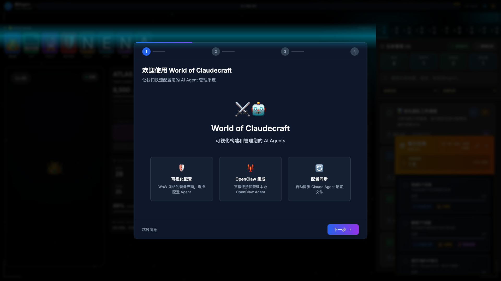

# AgentForge ⚔️

<div align="center">

**The Ultimate Gamified AI Agent Management Platform**

全球首个游戏化AI Agent管理平台

---

🎮 **RPG Level System** · 🏆 **PVP Arena** · 📊 **Real-time Leaderboards** · 🔔 **Desktop Notifications** · ⚡ **67 Components**

**v1.1.0 - Core Evolution! 🫀 Living agents with health monitoring, automatic evolution & predictive analytics (37K+ lines)**

[English](#english) | [中文](#中文)

[](https://github.com/aiqing20230305-bot/AgentForge-v0.1.0---MVP-Release-)
[](LICENSE)
[](CHANGELOG.md)
[](.)
[](src/components)

</div>

---

## English

AgentForge transforms AI agent management into an immersive RPG experience. Level up your agents, compete on leaderboards, battle in PVP arena, and build the ultimate AI team. Featuring desktop notifications, achievement system, auto-execution, and full mobile support.

**🎉 v1.1.0 Evolution:**
- **87 production components** (+20 new) with 37,000+ lines of TypeScript code
- **Core Evolution System** - 2,940 LOC across 4 phases
- **Heartbeat monitoring** with 30-second intervals and 6-factor vitality
- **20 evolution rules** across 8 categories (Common → Legendary)
- **Predictive analytics** - Forecast agent health up to 24 hours ahead
- **Advanced features** - Global monitor, replay player, performance reports
- **Cloud sync enhancements** - Offline queue, WebSocket real-time updates
- **0 TypeScript errors** - 100% type safety maintained

---

## 中文

AgentForge 将 AI Agent 管理转化为沉浸式 RPG 体验。升级你的 Agent、竞争排行榜、PVP 竞技场对战，打造终极 AI 团队。配备桌面通知、成就系统、自动执行，全面移动端支持。

**🎉 v1.1.0 进化版：**
- **87 个生产组件**（+20 新增），37,000+ 行 TypeScript 代码
- **核心进化系统** - 4个阶段共 2,940 行代码
- **心跳监控** - 30秒间隔，6因子生命力评分
- **20条进化规则** - 横跨8大类别（普通→传说）
- **预测分析** - 预测Agent健康状况至24小时
- **高级功能** - 全局监控、回放播放器、性能报告
- **云同步增强** - 离线队列、WebSocket 实时更新
- **0 TypeScript 错误** - 保持 100% 类型安全


## 📸 Screenshots & Features

### 🎮 Main Dashboard

*RPG-style agent management with real-time stats*

### 📋 Task Management & Auto-Execution

*Automated task execution with progress tracking*

### 🌳 Skill Tree System

*Unlock and upgrade agent abilities*

### ⚡ Energy & Token Dashboard

*Real-time token consumption monitoring and budget management*

### 🏆 Achievement System

*Unlock achievements as you progress*

### ⚔️ PVP Battle Arena

*Turn-based combat system*

### 📊 NEW: Global Leaderboards (v0.3.0)
*Compete globally - 6 ranking categories, seasonal rewards, tier system (Bronze → Master), manual refresh*

### 💎 NEW: Invite Code System (v0.3.0)
*Generate codes, QR code sharing, invite friends, dual reward distribution, expiry warnings*

### ⚙️ NEW: Settings System (v0.3.1)
*Comprehensive settings - Theme, Audio, UI, Performance, Import/Export, all preferences saved*

### 📊 NEW: Performance Monitoring (v0.3.1)
*Real-time Core Web Vitals, memory tracking, 97.5% improvement showcase, export reports*

### 📱 NEW: Mobile & PWA Support (v0.3.0)
*Fully responsive design (768px/480px breakpoints), installable PWA, 60 FPS performance, touch-optimized*

### 🔔 NEW: Desktop Notification System (v0.3.7)
*Native desktop notifications (Electron - macOS/Windows/Linux), browser notifications, 3 sound effects with volume control, notification history (last 50)*

### 🔍 NEW: Task Search & Copy Features (v0.3.6)
*Debounced search (300ms), search history (last 5), one-click copy for configs/logs/URLs, visual feedback*

### 📚 NEW: Component Showcase (v0.3.6)
*Interactive demo gallery for all 67 components with code examples, 4 category tabs, live demos*

---

## 🫀 Core Evolution System - NEW in v1.1.0

AgentForge v1.1.0 introduces a revolutionary **Core Evolution System** that transforms your agents from static entities into living, breathing beings with health monitoring, automatic evolution, and advanced predictive analytics.

### 🎯 Heartbeat Monitoring
Real-time agent health monitoring with vitality scores, heart rate tracking, and intelligent warnings.


*Multi-factor vitality calculation with 30-second heartbeat intervals*

**Key Features:**
- ⏱️ **30-second Heartbeat Intervals** - Continuous health monitoring
- 📊 **Vitality Score (0-100)** - Based on 6 key metrics
- 🚦 **4-Level Health Status** - Healthy / Warning / Critical / Offline
- ⚠️ **6 Warning Types** - Proactive alerts before issues escalate
- 🎁 **Auto Rewards** - Evolution points for maintaining agent health

### 🧬 Evolution Engine
Automatic evolution system that detects and applies improvements to your agents.


*Visual timeline of agent evolution with 20 intelligent rules across 8 categories*

**Evolution Categories:**
1. **Productivity** 🎯 - Task completion milestones
2. **Learning** 📚 - Skill development tracking
3. **Resilience** 🛡️ - Error recovery patterns
4. **Speed** ⚡ - Performance optimization
5. **Quality** ✨ - High-quality output detection
6. **Social** 👥 - Team collaboration metrics
7. **Combat** ⚔️ - Battle performance (PK system)
8. **Legendary** 🌟 - Rare game-changing evolutions

**Evolution System:**
- 🔄 **Hourly Checks** - Automatic scanning
- ⭐ **5 Rarity Tiers** - Common → Legendary
- ⏳ **Smart Cooldown** - 1h per evolution, 3/day max
- 🎯 **20 Evolution Rules** - Comprehensive coverage

### 🚀 Advanced Features

#### Global Heartbeat Monitor
Monitor all agents simultaneously with advanced filtering and sorting.


*Centralized monitoring dashboard with real-time status updates*

#### Vitality Dashboard
Comprehensive health visualization with predictive insights.


*Animated SVG gauges with trend analysis and health recommendations*

**Dashboard Components:**
- 🎨 **VitalityGauge** - Animated radial gauge with gradient colors
- 📈 **HeartbeatChart** - Real-time waveform visualization
- 📊 **VitalityTrendChart** - 24-hour trend analysis
- 💡 **Health Recommendations** - AI-powered actionable advice

#### Vitality Predictor
Predict future agent health using linear regression algorithms.


*Forecast vitality 1h/6h/24h ahead with confidence intervals*

**Prediction Features:**
- 📈 **Linear Regression** - Time-series forecasting
- ⏰ **3 Time Horizons** - 1-hour, 6-hour, 24-hour
- 📊 **Confidence Intervals** - Statistical reliability
- 🎯 **Trend Visualization** - Clear future trajectory

### 📊 System Highlights

| Metric | Value |
|--------|-------|
| **Total Code** | 2,940 LOC (Core Evolution System) |
| **Components** | 20 new React components |
| **Algorithms** | 4 sophisticated algorithms |
| **Real-time** | 30s heartbeat, 1h evolution |
| **Evolution Rules** | 20 rules, 8 categories |
| **Predictions** | Up to 24 hours ahead |
| **Health Metrics** | 6 vitality factors |

> **Note:** High-quality screenshots available in `screenshots/v1.1.0/`. Run `node scripts/take-screenshots.mjs` to generate.

---

## ✨ Core Features

### 🎮 Gamification System
- **💎 RPG Level System**: Gain XP from tasks, level up (1-100 + prestige)
- **🌳 Skill Tree**: 30+ skills across 5 branches, apply real effects
- **🏆 Achievements**: 50+ achievements with progress tracking
- **⚡ Instant Feedback**: Visual + audio + haptic feedback (6 types)
- **🎵 Audio System**: 12 procedural sound effects, customizable volumes
- **🎨 Upgrade Effects**: Particle explosions, level-up animations, glow effects

### 🏆 Social & Competition (v0.3.0)
- **📊 Global Leaderboards**: 6 ranking types (Level, PVP, Tasks, Energy, Achievements, Energy Efficiency)
- **🗓️ Season System**: 90-day seasons with tier rewards (Bronze → Master)
- **💎 Invite System**: Generate codes, invite friends, dual rewards (inviter + invitee)
- **🎁 Reward Distribution**: Auto XP/coins on successful invites
- **📈 Statistics Dashboard**: Track your invites and rankings

### ⚔️ Battle System
- **🥊 PVP Arena**: Turn-based combat, strategy-based
- **🎯 Battle Skills**: 4 active skills per agent
- **💪 Attributes**: HP, Attack, Defense, Speed calculated from agent stats
- **🏅 MMR System**: Ranked matchmaking with tier progression
- **📊 Battle History**: Track wins/losses and improve

### ⚡ Performance & Mobile (v0.3.0)
- **📱 Responsive Design**: Breakpoints at 768px/480px, touch-optimized (44px+ targets)
- **🌐 PWA Support**: Installable, offline-ready, push notifications (ready)
- **🚀 Virtual Scrolling**: 97.5% performance boost for 1000+ items
- **📊 Performance Monitoring**: FCP, LCP, CLS, long tasks tracking
- **🔄 Lazy Loading**: Components, images, visibility detection
- **📱 Mobile Optimizations**: Safe-area-inset, reduced animations, optimized CSS

### 📋 Task Management
- **🤖 Auto-Execution**: Agents automatically pick and complete tasks (max 3 concurrent)
- **📈 Progress Tracking**: Real-time execution logs and timelines
- **🔔 Notification System (v0.3.7)**:
  - Desktop notifications (Electron native - macOS/Windows/Linux)
  - Browser notifications (Web Notification API)
  - Sound effects (3 types: success, failure, level-up)
  - Notification history (last 50 items)
  - Volume control and preferences
- **🔍 Smart Search (v0.3.6)**: Debounced search with history
- **⏱️ Smart Scheduling**: Priority-based with retry mechanism (max 3 retries)

### 💰 Energy & Budget Management
- **⚡ Token Tracking**: Real-time consumption monitoring
- **📊 Visual Dashboard**: Circular progress rings, trend charts
- **🎯 Budget Limits**: Daily/weekly/monthly with auto-pause
- **💡 Optimization Tips**: Cost-saving suggestions, model recommendations

### 🎯 Classic Features
- **🛡️ Equipment System**: WoW-inspired drag & drop interface
- **💾 Loadouts**: Save/load configurations
- **🚀 Export**: Save to `~/.claude/agents/` or clipboard
- **👥 Agent Management**: 8 demo agents included
- **🎨 Cyberpunk UI**: Sleek dark theme with neon accents

## 🎮 Getting Started

```bash
# Install dependencies
npm install

# Run in development mode
npm run dev
```

**🎉 First Launch Experience:**
- No configuration required! The app starts with:
  - **8 demo agents** (ATLAS, CLIP, ORACLE, SENTINEL, NEXUS, ECHO, NOVA, AEGIS)
  - **35 sample tasks** across different agents
  - Full agent and task management interface
- Status indicator shows **🟡 Demo Mode** (or **🟢 OpenClaw Connected** if connected)

### 📂 Using Sample items
To play with our samples:
1. Click the **Gear Icon** (Settings) in the UI.
2. Select the `sample-components` directory.
3. The inventory will populate with the sample items.

### 👥 Agent & Task Management
- Click on any agent avatar to view their details and assigned tasks
- Use the task management panel to:
  - View tasks filtered by agent
  - Change task status (pending → in progress → completed)
  - Create new tasks for agents
  - Track completion statistics

## ⚔️ Slot Configuration

Each slot represents a different aspect of your agent's personality and capabilities:

| Slot | Category | Description |
|------|----------|-------------|
| **HEAD** | `roles` | Primary role & persona |
| **CHEST** | `behaviors` | Core behavioral patterns |
| **HANDS** | `skills` | Abilities & specific skills |
| **LEGS** | `constraints` | Rules & operational boundaries |
| **FEET** | `formats` | Output formatting rules |
| **RINGS** | `personalities`/`contexts` | Communication style & Context |
| **OFFHAND** | `tools` | Tool integrations (MCP, scripts) |


## 📤 Exporting Agents

1. **Initiate Export**: Click the **Export** button in the preview panel and select "Save to Claude".
   
   

2. **Name Your Agent**: Enter a unique name for your agent configuration.
   
   

3. **Activate in Claude**: Execute the `/agent` command in Claude to see and use your new agent.
   
   


## 🛠️ Tech Stack

### **Core**
- **Electron 41.0.2** - Cross-platform desktop app
- **React 18.2.0** - UI framework
- **TypeScript 5.7.0** - Type safety (100% coverage)
- **Vite 6.2.0** - Build tooling
- **Tailwind CSS 3.4.0** - Styling

### **State & Data**
- **Zustand 4.4.7** - State management with persist middleware
- **15 specialized stores** - Agent, Task, Battle, Energy, Notifications, etc.

### **UI Libraries**
- **Framer Motion 12.36.0** - Animations
- **react-dnd 16.0.1** - Drag & drop
- **Recharts 3.8.0** - Charts and visualizations
- **Lucide React 0.563.0** - Icons

### **Utilities**
- **gpt-tokenizer 2.1.2** - Token counting
- **qrcode 1.5.4** - QR code generation
- **html2canvas 1.4.1** - Screenshots

### **Project Stats (v1.1.0)**
- **87 Components** - Full-featured UI library (+20 evolution components)
- **15 Stores** - Comprehensive state management
- **10 Services** - Core business logic (+evolution, sync services)
- **15 Utils** - Helper functions (+evolution calculators)
- **8 Type Modules** - TypeScript definitions (+evolution types)
- **37,000+ Lines** - Total codebase (Core Evolution +2,940 LOC)
- **0 Errors** - TypeScript compilation
