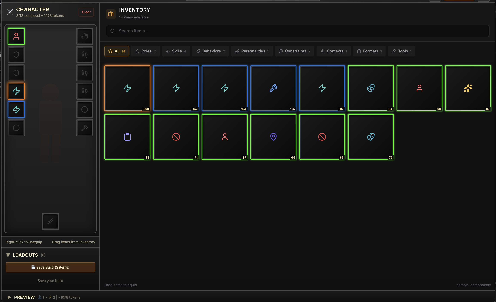

# World of Claudecraft ⚔️🤖

**Gamified Agent Builder.** Agent Builder with RPG loadout.

Instead of writing md files, equip your Claude agent like an RPG character. Drag and drop equipment into slots to build a combined agent configuration.



## ✨ Features

- **🛡️ Visual Equipment UI**: WoW-inspired character equipment interface
- **🐉 Drag & Drop**: Drag items from inventory to equipment slots
- **💰 Token Budget**: Track token usage with budget limits and rarity colors
- **📜 Category System**: Items categorized as roles, skills, behaviors, etc.
- **💾 Loadouts**: Save and load different equipment configurations
- **🚀 Export**: Save directly to `~/.claude/agents/your-agent-name.md` or clipboard

## 🎮 Getting Started

```bash
# Install dependencies
npm install

# Run in development mode
npm run dev
```

### 📂 Using Sample items
To play with our samples:
1. Click the **Gear Icon** (Settings) in the UI.
2. Select the `sample-components` directory.
3. The inventory will populate with the sample items.

## ⚔️ Slot Configuration

Each slot represents a different aspect of your agent's personality and capabilities:

| Slot | Category | Description |
|------|----------|-------------|
| **HEAD** | `roles` | Primary role & persona |
| **CHEST** | `behaviors` | Core behavioral patterns |
| **HANDS** | `skills` | Abilities & specific skills |
| **LEGS** | `constraints` | Rules & operational boundaries |
| **FEET** | `formats` | Output formatting rules |
| **RINGS** | `personalities`/`contexts` | Communication style & Context |
| **OFFHAND** | `tools` | Tool integrations (MCP, scripts) |

## 🛠️ Tech Stack

- **Electron** & **React 18**
- **TypeScript** & **Vite**
- **Tailwind CSS** for styling
- **Zustand** for state management
- **react-dnd** for drag-and-drop interactions
